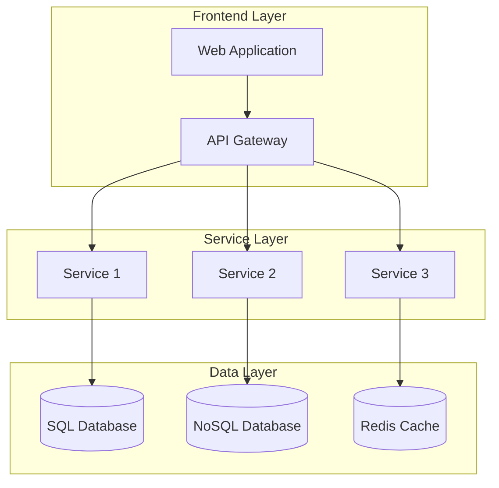

# Phase 1: Foundation & Standards - Detailed Implementation Plan

## Overview

**Duration:** 2-3 months  
**Budget:** $205,500  
**Team Size:** 4-5 people  
**Primary Goal:** Establish the foundational infrastructure, standards, and processes required for AI-driven development

Phase 1 is the most critical phase as it sets the foundation for the entire transformation. Success here directly impacts the effectiveness of all subsequent phases.

---

## Pre-Phase 1: Project Kickoff (Week 0)

### Executive Alignment Workshop (2 days)
**Participants:** Executive sponsor, development director, key stakeholders

**Day 1 Agenda:**
- Project vision and strategic alignment
- Success metrics definition and agreement
- Budget approval and resource commitment
- Risk appetite discussion
- Communication strategy establishment

**Day 2 Agenda:**
- Team structure and roles definition
- Governance framework establishment
- Initial timeline review and approval
- Stakeholder engagement plan
- Project charter final approval

**Deliverables:**
- Signed project charter
- Executive commitment letter
- Initial risk register
- Communication plan

---

## Month 1: Analysis and Current State Assessment

### Week 1-2: Comprehensive Current State Analysis

#### Week 1: Repository and Codebase Inventory

**Day 1-2: Repository Discovery**
```powershell
# Example PowerShell scripts for repository analysis
# Repository enumeration across Azure DevOps
az repos list --organization https://dev.azure.com/[YourOrg] --project [ProjectName]

# Code metrics collection
git log --oneline --since="1 year ago" | wc -l
git ls-files | grep -E "\.(cs|bicep|yaml|yml)$" | wc -l
```

**Activities:**
- Complete inventory of all repositories in your multi-repo architecture
- Catalog each repository's purpose, dependencies, and complexity
- Document current branching strategies and deployment processes
- Analyze code complexity metrics (lines of code, cyclomatic complexity, dependencies)
- Identify repositories with high development velocity for pilot selection

**Day 3-5: Technology Stack Analysis**
- C# codebase patterns and architectural styles analysis
- Bicep template standardization assessment  
- Docker containerization consistency review
- Database schema and integration pattern documentation
- YAML pipeline standardization level assessment

**Deliverables:**
- Repository inventory spreadsheet with metadata
- Technology stack assessment report
- Code complexity metrics dashboard
- Dependency mapping diagrams
- Pilot repository recommendation list

#### Week 2: DevOps Work Item Process Analysis

**Day 1-3: Current Work Item Analysis**
- Audit existing work item templates and fields
- Analyze acceptance criteria quality and consistency
- Review work item lifecycle and approval processes
- Document current estimation and planning methods
- Assess integration between work items and development workflow

**Day 4-5: Gap Analysis and Requirements**
- Identify gaps in current acceptance criteria for AI consumption
- Define additional metadata requirements for AI processing
- Document process improvement opportunities
- Assess tool integration capabilities
- Create requirements for enhanced work item templates

**Deliverables:**
- Current state work item process documentation
- Gap analysis report with recommendations
- Requirements specification for enhanced work items
- Process improvement roadmap

### Week 3-4: Standards Development and Template Creation

#### Week 3: Acceptance Criteria Standardization

**Day 1-2: Template Design**
Create standardized templates for different work item types:

**Feature Development Template:**
```markdown
# Feature: [Feature Name]

## Business Context
- **Business Objective:** [Clear business goal]
- **User Story:** As a [user type], I want [functionality] so that [benefit]
- **Business Value:** [Quantifiable value/impact]

## Functional Requirements
### Core Functionality
- **Primary Flow:** [Step-by-step primary user flow]
- **Alternative Flows:** [Edge cases and alternative scenarios]
- **Business Rules:** [Specific business logic requirements]

### Technical Constraints
- **Performance Requirements:** [Response times, throughput]
- **Security Requirements:** [Authentication, authorization, data protection]
- **Integration Requirements:** [External systems, APIs, databases]
- **Compliance Requirements:** [Regulatory, organizational policies]

## Acceptance Criteria
### Given-When-Then Scenarios
1. **Scenario 1:** 
   - Given [initial conditions]
   - When [user action or system event]
   - Then [expected outcome]

### API Requirements (if applicable)
- **Endpoints:** [Required API endpoints with methods]
- **Request/Response Models:** [Data structures]
- **Error Handling:** [Expected error responses]

### Database Changes (if applicable)
- **Schema Changes:** [New tables, fields, relationships]
- **Migration Requirements:** [Data migration needs]
- **Performance Impact:** [Index requirements, query optimization]

## AI Metadata
- **Complexity Level:** [Simple/Medium/Complex]
- **Affected Components:** [List of systems/services impacted]
- **Similar Patterns:** [References to existing similar implementations]
- **Code Generation Hints:** [Specific patterns or templates to use]
```

**Day 3-5: Schema Definition**
Create detailed schemas for:
- Bug fix work items
- Infrastructure change requests
- Performance improvement tasks
- Technical debt items

**Deliverables:**
- Complete set of work item templates
- Field definitions and validation rules
- Template implementation guide
- Training materials for product owners

#### Week 4: Coding Standards and Pattern Documentation

**Day 1-3: Coding Standards Creation**
```csharp
// Example C# coding standards for AI consumption

namespace Company.Project.Domain
{
    /// <summary>
    /// Repository pattern implementation for [Entity] management
    /// AI_PATTERN: Repository with generic base implementation
    /// AI_DEPENDENCIES: IRepository<T>, DbContext, AutoMapper
    /// </summary>
    public class EntityRepository : IEntityRepository
    {
        // AI_GENERATION_HINT: Standard constructor injection pattern
        private readonly DbContext _context;
        private readonly IMapper _mapper;
        
        public EntityRepository(DbContext context, IMapper mapper)
        {
            _context = context ?? throw new ArgumentNullException(nameof(context));
            _mapper = mapper ?? throw new ArgumentNullException(nameof(mapper));
        }
        
        // AI_PATTERN: Standard CRUD operations with async implementation
        public async Task<EntityDto> GetByIdAsync(int id)
        {
            // Implementation follows standard pattern
        }
    }
}
```

**Activities:**
- Document naming conventions with AI-friendly annotations
- Create architectural pattern library with AI generation hints
- Define code structure standards for consistency
- Document exception handling and logging patterns
- Create database interaction patterns and best practices

**Day 4-5: Template Pattern Library**
Create reusable templates for:
- Controller templates with standard CRUD operations
- Service layer templates with dependency injection
- Repository pattern implementations
- DTO and model class templates
- Bicep infrastructure templates

**Deliverables:**
- Comprehensive coding standards document
- Annotated code pattern library
- Template generation rules
- Code review checklist for AI-generated code

---

## Month 2: Infrastructure Setup and Documentation

### Week 5-6: Architecture Documentation

#### Week 5: System Architecture Documentation

**Day 1-2: Service Architecture Mapping**


**Activities:**
- Create comprehensive architecture decision records (ADRs)
- Document service boundaries and responsibilities
- Map data flow between services and external systems
- Document security architecture and authentication flows
- Create deployment architecture diagrams

**Day 3-5: API Documentation and Contracts**
- Generate OpenAPI specifications for all existing APIs
- Document API versioning strategies and compatibility requirements
- Create data contract documentation
- Document authentication and authorization mechanisms
- Establish API testing and validation standards

**Deliverables:**
- Complete system architecture documentation
- Service dependency maps
- ADR repository with historical decisions
- API specification library
- Data flow documentation

#### Week 6: Database Schema and Integration Documentation

**Day 1-3: Database Documentation**
```sql
-- Example annotated database schema for AI consumption
-- AI_PATTERN: Standard audit trail implementation
-- AI_GENERATION_HINT: Include created/modified fields in all entities

CREATE TABLE [dbo].[Customer] (
    [Id] INT IDENTITY(1,1) NOT NULL,
    [Name] NVARCHAR(255) NOT NULL,
    [Email] NVARCHAR(255) NOT NULL,
    -- AI_PATTERN: Standard audit fields
    [CreatedDate] DATETIME2 NOT NULL DEFAULT GETUTCDATE(),
    [CreatedBy] NVARCHAR(100) NOT NULL,
    [ModifiedDate] DATETIME2 NULL,
    [ModifiedBy] NVARCHAR(100) NULL,
    -- AI_PATTERN: Soft delete implementation
    [IsDeleted] BIT NOT NULL DEFAULT 0,
    
    CONSTRAINT [PK_Customer] PRIMARY KEY ([Id]),
    CONSTRAINT [UK_Customer_Email] UNIQUE ([Email])
);

-- AI_GENERATION_HINT: Standard index patterns for lookups
CREATE NONCLUSTERED INDEX [IX_Customer_Email] ON [dbo].[Customer] ([Email]) WHERE [IsDeleted] = 0;
```

**Activities:**
- Document all database schemas with AI-friendly annotations
- Create entity relationship diagrams
- Document data migration patterns and scripts
- Establish database performance optimization patterns
- Create stored procedure and function templates

**Day 4-5: Integration Pattern Documentation**
- Document message queue and event streaming patterns
- Create API integration templates and error handling
- Document caching strategies and implementation patterns
- Create monitoring and logging integration patterns
- Establish security and compliance integration requirements

**Deliverables:**
- Complete database schema documentation
- Integration pattern library
- Data migration template library
- Performance optimization guidelines

### Week 7-8: AI Infrastructure Setup

#### Week 7: AI Service Configuration

**Day 1-2: Azure OpenAI Setup**
```powershell
# Azure OpenAI Service deployment script
az cognitiveservices account create \
    --name "ai-development-assistant" \
    --resource-group "rg-ai-development" \
    --location "eastus" \
    --kind "OpenAI" \
    --sku "S0" \
    --subscription "[SubscriptionId]"

# Configure model deployments
az cognitiveservices account deployment create \
    --name "ai-development-assistant" \
    --resource-group "rg-ai-development" \
    --deployment-name "gpt-4" \
    --model-name "gpt-4" \
    --model-version "1106-preview" \
    --model-format "OpenAI" \
    --scale-type "Standard" \
    --capacity 10
```

**Activities:**
- Set up Azure OpenAI service or GitHub Copilot for Business
- Configure service quotas and rate limiting
- Implement API key management and rotation
- Set up monitoring and usage tracking
- Configure backup and disaster recovery

**Day 3-5: Security and Governance Implementation**
```yaml
# Example Azure Policy for AI service governance
policyRule:
  if:
    field: "type"
    equals: "Microsoft.CognitiveServices/accounts"
  then:
    effect: "audit"
    details:
      type: "Microsoft.CognitiveServices/accounts/deployments"
      existenceCondition:
        allOf:
          - field: "Microsoft.CognitiveServices/accounts/deployments/properties.model.name"
            in: ["gpt-4", "gpt-35-turbo"]
          - field: "Microsoft.CognitiveServices/accounts/deployments/properties.raiPolicyName"
            exists: true
```

**Activities:**
- Implement security policies and access controls
- Set up audit logging and compliance monitoring
- Create data governance policies for AI usage
- Establish cost management and budget alerts
- Configure network security and private endpoints

**Deliverables:**
- Operational AI service infrastructure
- Security configuration documentation
- Governance policy implementation
- Cost monitoring and alerting setup

#### Week 8: Development Environment Setup

**Day 1-3: Sandbox Environment Creation**
```bicep
// Example Bicep template for AI development sandbox
resource aiDevelopmentRG 'Microsoft.Resources/resourceGroups@2021-04-01' = {
  name: 'rg-ai-development-sandbox'
  location: 'eastus'
}

resource openAIService 'Microsoft.CognitiveServices/accounts@2023-05-01' = {
  name: 'openai-dev-sandbox'
  location: aiDevelopmentRG.location
  kind: 'OpenAI'
  properties: {
    customSubDomainName: 'ai-dev-sandbox'
    networkAcls: {
      defaultAction: 'Allow'
      virtualNetworkRules: []
      ipRules: []
    }
  }
}
```

**Activities:**
- Create isolated development sandbox environments
- Set up development tools and IDE integrations
- Configure local development workflows
- Implement testing and validation frameworks
- Create developer onboarding documentation

**Day 4-5: Integration Testing**
- Test AI service connectivity and authentication
- Validate development workflows and tool integrations
- Perform basic code generation testing
- Test security controls and access policies
- Document troubleshooting procedures

**Deliverables:**
- Functional development sandbox environments
- Developer setup documentation
- Integration testing results
- Troubleshooting and support documentation

---

## Month 3: Training and Process Integration

### Week 9-10: Team Training and Knowledge Transfer

#### Week 9: AI-Assisted Development Workshops

**Day 1: AI Fundamentals Workshop (8 hours)**

**Morning Session (4 hours):**
- Introduction to AI-assisted development concepts
- Large Language Models and code generation capabilities
- Prompt engineering fundamentals
- AI limitations and best practices

**Afternoon Session (4 hours):**
- Hands-on AI tool usage (GitHub Copilot, Azure OpenAI)
- Code generation exercises and quality assessment
- Integration with existing development workflows
- Q&A and troubleshooting session

**Day 2-3: Technical Implementation Training**
- Deep dive into AI service APIs and integration patterns
- Custom prompt development and testing
- Quality assurance techniques for AI-generated code
- Security considerations and validation processes

**Day 4-5: Process Integration Training**
- Enhanced work item creation and management
- AI-assisted development workflow walkthrough
- Code review processes for AI-generated code
- Metrics and monitoring setup

**Deliverables:**
- Training completion certificates
- Developer competency assessments
- Feedback collection and analysis
- Updated training materials based on feedback

#### Week 10: Specialized Role Training

**Product Owner Training (2 days):**
- Enhanced acceptance criteria writing techniques
- AI metadata requirements and best practices  
- Quality assessment methods for AI-generated features
- Integration with development team workflows

**Architecture Team Training (3 days):**
- AI service integration architecture patterns
- Security and governance considerations
- Performance and scalability planning
- Advanced prompt engineering and template creation

**DevOps Team Training (2 days):**
- AI service integration in CI/CD pipelines
- Monitoring and alerting for AI-assisted development
- Cost optimization and resource management
- Troubleshooting and support procedures

**Deliverables:**
- Role-specific competency assessments
- Specialized documentation and procedures
- Integration testing results
- Support and escalation procedures

### Week 11-12: Process Integration and Validation

#### Week 11: DevOps Integration Implementation

**Day 1-2: Work Item Template Integration**
```yaml
# Azure DevOps work item template integration
# Custom work item type for AI-assisted development
witd:
  name: "AI-Enhanced User Story"
  description: "User story with AI generation metadata"
  fields:
    - name: "AI.Complexity"
      type: "String"
      allowedValues: ["Simple", "Medium", "Complex"]
      required: true
    - name: "AI.AffectedComponents"
      type: "Text"
      required: true
    - name: "AI.SimilarPatterns"
      type: "Text"
      required: false
    - name: "AI.GenerationHints"
      type: "HTML"
      required: false
```

**Activities:**
- Deploy enhanced work item templates to Azure DevOps
- Configure field validation and workflow rules
- Set up automated notifications and triggers
- Test work item creation and update processes
- Train teams on new template usage

**Day 3-5: Workflow Process Implementation**
- Implement AI development workflow in existing processes
- Configure integration points with development tools
- Set up automated quality gates and validation
- Create monitoring dashboards for process metrics
- Test end-to-end workflow functionality

**Deliverables:**
- Operational enhanced work item templates
- Integrated development workflow processes
- Process monitoring and metrics collection
- User acceptance testing results

#### Week 12: Quality Assurance and Code Review Integration

**Day 1-3: Code Review Process Enhancement**
```markdown
# AI-Generated Code Review Checklist

## Functionality Review
- [ ] Code meets acceptance criteria requirements
- [ ] Business logic correctly implements specified rules
- [ ] Error handling follows established patterns
- [ ] Integration points properly implemented

## Quality Review  
- [ ] Code follows established coding standards
- [ ] Naming conventions consistently applied
- [ ] Comments and documentation adequate
- [ ] Test coverage meets minimum requirements

## Security Review
- [ ] No hardcoded secrets or sensitive data
- [ ] Input validation properly implemented
- [ ] Authentication/authorization correctly applied
- [ ] Security scanning results reviewed and cleared

## AI-Specific Review
- [ ] Generated code reviewed by human developer
- [ ] AI generation prompts and context documented
- [ ] Alternative implementation approaches considered
- [ ] Performance implications assessed and acceptable
```

**Activities:**
- Implement enhanced code review guidelines
- Configure automated code quality checks
- Set up security scanning for AI-generated code
- Create review assignment and approval workflows
- Test review process with sample AI-generated code

**Day 4-5: Metrics and Monitoring Setup**
```powershell
# Example PowerShell for metrics collection setup
# Azure Monitor custom metrics for AI development

$customMetrics = @{
    "ai_code_generation_requests" = "Count of AI code generation requests"
    "ai_code_quality_score" = "Average quality score of AI-generated code"
    "ai_code_review_time" = "Time spent reviewing AI-generated code"
    "ai_development_velocity" = "Development velocity with AI assistance"
}

foreach ($metric in $customMetrics.GetEnumerator()) {
    # Configure custom metric in Azure Monitor
    Write-Output "Setting up metric: $($metric.Key)"
}
```

**Activities:**
- Implement comprehensive metrics collection
- Create development productivity dashboards
- Set up alerting for quality and performance issues
- Configure cost monitoring and optimization
- Test monitoring and reporting functionality

**Deliverables:**
- Operational code review processes
- Metrics collection and monitoring systems
- Quality assurance framework
- Performance and cost monitoring setup

### Week 12: Phase 1 Retrospective and Handoff

**Day 1-2: Comprehensive Testing and Validation**
- End-to-end process testing with real scenarios
- Performance and scalability validation
- Security and compliance verification
- User acceptance testing with development teams
- Documentation review and updates

**Day 3-4: Retrospective and Lessons Learned**
- Team retrospective sessions with all participants
- Success metrics evaluation against Phase 1 objectives
- Issue identification and resolution planning
- Process improvement recommendations
- Knowledge capture and documentation

**Day 5: Phase 2 Preparation and Handoff**
- Phase 2 team preparation and knowledge transfer
- Updated project timeline and resource allocation
- Risk register updates and mitigation planning
- Stakeholder communication and approval for Phase 2
- Phase 1 completion celebration and recognition

**Deliverables:**
- Complete Phase 1 testing and validation results
- Retrospective report with lessons learned
- Updated project plan and risk register
- Phase 2 readiness assessment
- Phase 1 completion report and success metrics

---

## Phase 1 Success Criteria Validation

### Quantitative Success Metrics
- [ ] 100% of repositories documented and categorized
- [ ] AI infrastructure operational with 99%+ uptime
- [ ] All team members trained with passing competency assessments
- [ ] Enhanced work item templates deployed and functional
- [ ] Code review processes operational with <10% rejection rate

### Qualitative Success Metrics
- [ ] Team confidence in AI-assisted development approach
- [ ] Stakeholder satisfaction with progress and communication
- [ ] Clear understanding of AI capabilities and limitations
- [ ] Effective collaboration between teams and roles
- [ ] Comprehensive documentation and knowledge transfer

### Risk Mitigation Validation
- [ ] Security controls tested and validated
- [ ] Cost monitoring within approved budget ranges
- [ ] Quality assurance processes proven effective
- [ ] Change management resistance addressed
- [ ] Technical integration issues resolved

---

## Phase 1 Deliverables Summary

### Documentation Deliverables
1. **Repository Inventory and Analysis Report**
2. **Enhanced Work Item Templates and Schemas**
3. **Comprehensive Coding Standards and Pattern Library**
4. **System Architecture Documentation**
5. **AI Infrastructure Setup and Configuration Guide**
6. **Training Materials and Competency Assessments**
7. **Process Integration Documentation**
8. **Quality Assurance Framework**
9. **Metrics and Monitoring Setup Guide**
10. **Phase 1 Completion Report**

### Infrastructure Deliverables
1. **Operational AI Services (Azure OpenAI/GitHub Copilot)**
2. **Development Sandbox Environments**
3. **Enhanced CI/CD Pipeline Integration**
4. **Security and Governance Controls**
5. **Monitoring and Alerting Systems**

### Process Deliverables
1. **Enhanced DevOps Work Item Templates**
2. **AI-Assisted Development Workflow**
3. **Code Review Process with AI Guidelines**
4. **Quality Gates and Validation Procedures**
5. **Training and Onboarding Processes**

---

## Transition to Phase 2

### Phase 2 Readiness Checklist
- [ ] All Phase 1 deliverables completed and approved
- [ ] Team training completed with acceptable competency levels
- [ ] AI infrastructure operational and validated
- [ ] Enhanced processes deployed and functional
- [ ] Stakeholder approval for Phase 2 progression
- [ ] Phase 2 team and resources confirmed
- [ ] Budget and timeline approved for next phase
- [ ] Risk mitigation plans updated and approved

### Knowledge Transfer Requirements
- Complete documentation handoff to Phase 2 team
- Technical architecture and implementation knowledge transfer
- Process and workflow training for new team members
- Lessons learned and best practices communication
- Ongoing support and consultation availability

### Continuous Improvement
- Regular review and updates of documentation
- Process refinement based on usage feedback
- Technology updates and optimization
- Training material updates and improvements
- Metrics analysis and optimization recommendations

---

*Document Version: 1.0*  
*Last Updated: December 2024*  
*Phase 1 Duration: 2-3 months*  
*Next Phase: AI Training & Context Building*
